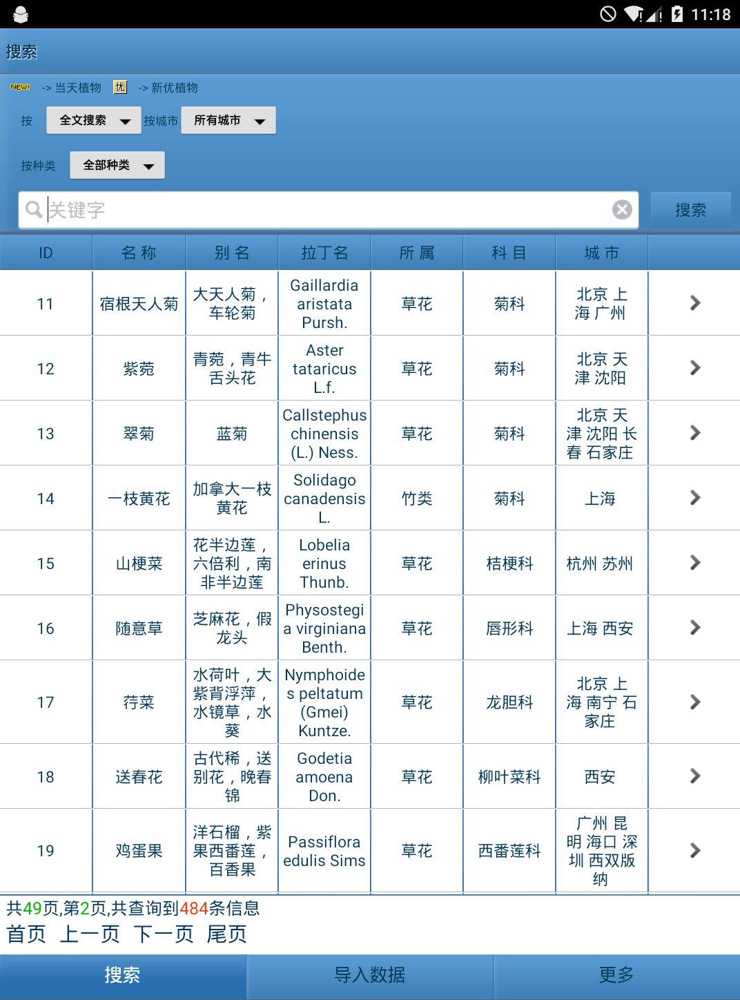

# PlantQuery
由于中国景观植物检索网http://plant.ela.cn/ 没有app，自己动手写的一个数据来源于该网站的Android App
由于数据是静态的可以离线使用，方便外业查询检索。
主要思路：
---------

 - 初始化从Assets里面拷贝数据到sdcard；
 - 读取Excel到sqlite；
 - sqlite的查询模糊多关键字查询；
 - sqlite的增删改查
 - service实现后台导入下载
 

